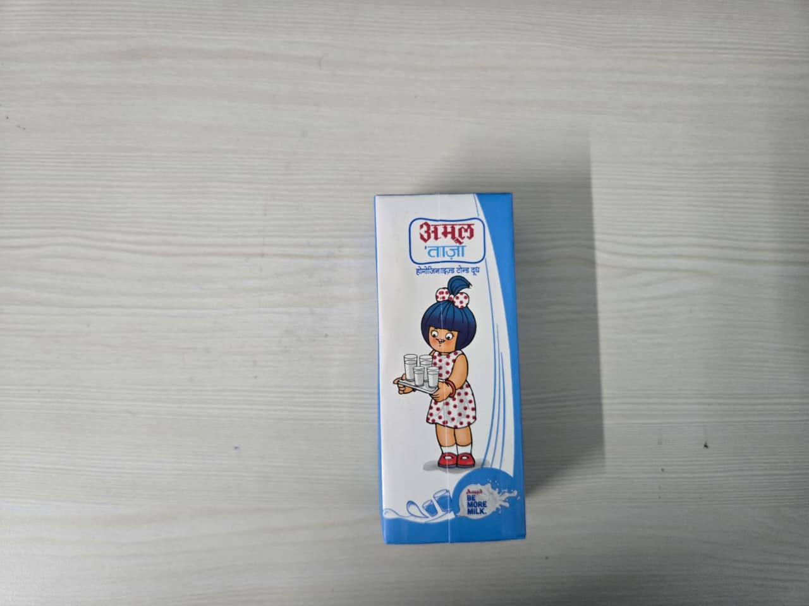
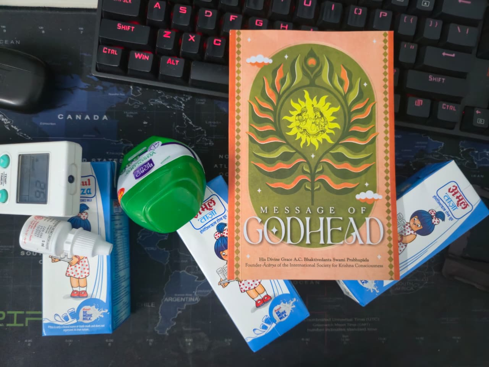
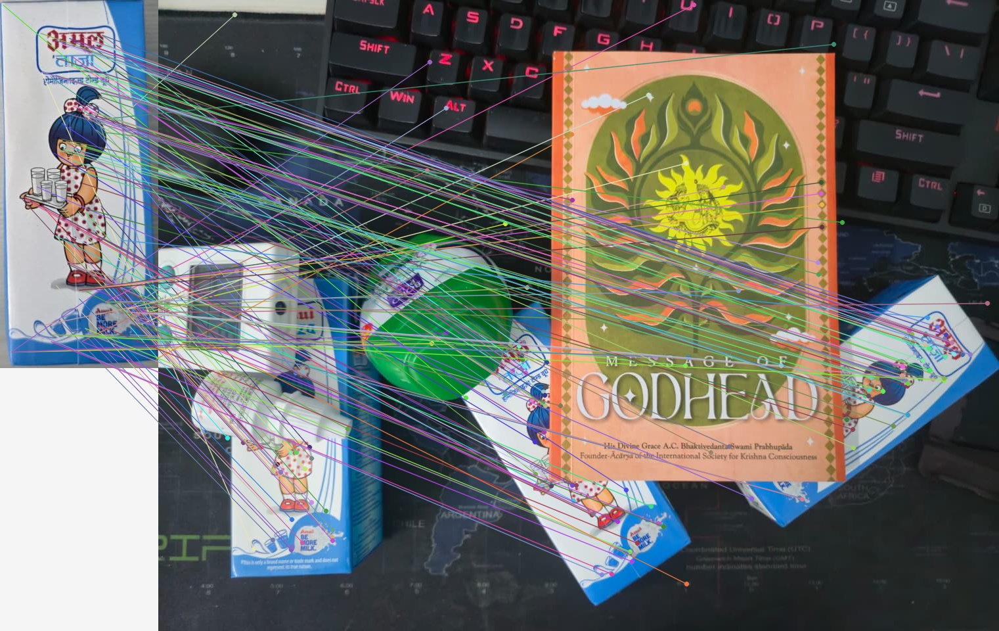
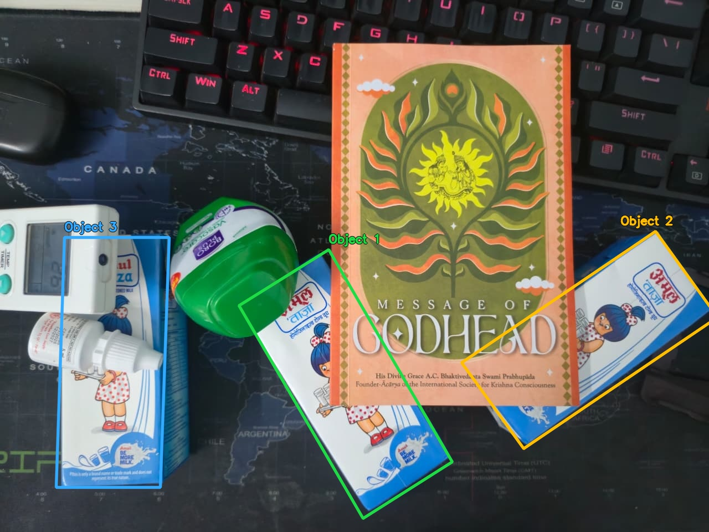

# Detecting repeated milk cartons in clutter

## 1. Object and photographs

The object is the printed front face of an Amul Taaza milk carton. Its lettering,
illustration, and lower graphics provide distinctive local features. The supplied
original photographs are `assets/template.jpeg` and `assets/scene.jpeg`, both
1280 × 960 pixels. The scene contains three cartons among a keyboard, book,
green container, electronic device, and small bottle. The cartons have different
rotations and are partly hidden; the right carton also reaches the image edge.

The template photograph includes considerable desk background. A manually
specified rectangle `(x=592, y=306, width=241, height=560)` isolates the carton
before SIFT extraction. This is template preparation; no locations in the scene
are annotated or supplied to the pipeline. Original photographs remain intact.

| Original template | Original cluttered scene |
| --- | --- |
|  |  |

## 2. Methods

**Features and matching.** OpenCV SIFT produces position, size, orientation, and
128D descriptors. For each scene descriptor, the implementation computes squared
Euclidean distance to every template descriptor using
`D² = ||s||² + ||t||² − 2 s·t`, clamped at zero for roundoff. Work is batched in
256-scene-descriptor blocks. The closest match is accepted if
`d1² < 0.78² × d2²`. Ambiguous ties fail. Scene-to-template matching preserves
multiple copies of the same printed detail across the scene.

**4D Generalized Hough Transform.** Each match estimates relative scale
`s = size_scene / size_template` and angle `θ = angle_scene − angle_template`.
Its predicted object center is `p_scene + s R(θ)(c_template − p_template)`.
Votes are accumulated in `(center_x, center_y, log2(s), θ)`. Each match votes in
16 neighboring cells, covering the lower and upper bin in all four dimensions.
Angles wrap periodically. Identical candidate match sets are deduplicated and
processed by decreasing support. Three votes create a candidate, not a detection.

**Affine verification.** Custom RANSAC samples three correspondences without
replacement. Repeated or collinear points and tiny triangles are rejected. The
six affine coefficients are solved with centered NumPy least squares. Euclidean
reprojection error is measured in original scene pixels. Consistent points are
counted once per template and scene location, reducing duplicate SIFT orientation
support. Models with a reflection, collapsed area, unreasonable singular values,
or excessive anisotropy are rejected. The best model is repeatedly refitted to
its inliers. RANSAC uses seed 7 and up to 1,200 trials, with adaptive stopping.

**Greedy extraction and refinement.** A Hough model seeds refinement across all
remaining matches, allowing consistent features outside that Hough cell to join.
Acceptance requires at least eight independent inliers, a convex hull covering
at least 2.5% of the template rectangle, and at least 25% of the predicted
boundary area inside the image. Only accepted geometric inliers are removed,
including redundant orientations; unrelated matches inside a boundary remain.
The process ends when no remaining cluster yields an acceptable model.

**Boundaries and NMS.** The four template-crop corners are transformed by each
affine. Polygon intersection is implemented with Sutherland–Hodgman clipping;
polygon area uses the shoelace formula. IoU is intersection area divided by union
area. At IoU greater than 0.45, the less-supported detection is suppressed,
breaking support ties with median reprojection error. This uses the oriented
polygons, rather than their axis-aligned enclosing rectangles.

All matching, voting, sampling, model scoring, refinement, convex hulls, polygon
intersection, and suppression are implemented in `vision.py`. OpenCV is limited
to SIFT, image I/O, color conversion, and rendering. No prohibited matcher,
transformation estimator, homography, or clustering library is used.

## 3. Parameters

| Parameter | Value | Reason |
| --- | --- | --- |
| SIFT contrast threshold | 0.025 | Retain weaker printed details |
| Lowe ratio | 0.78 | Preserve occluded-instance evidence while filtering ambiguous matches |
| Position bin | 70 scene pixels | Group moderately noisy center predictions |
| Log2-scale bin | 0.4 | About a 1.32× scale step |
| Rotation bin | 30° | 12 circular bins |
| Candidate support | 3 votes | Minimum affine sample size; geometry must still verify |
| RANSAC cap | 1,200 | Bounded robust estimation work |
| Reprojection threshold | 5 scene pixels | Tolerate localization error and mild non-affine effects |
| Minimum independent inliers | 8 | Require more support than a minimal three-point fit |
| Minimum hull coverage | 2.5% | Reject extremely concentrated support |
| Affine singular-value limits | 0.15–3.0 | Reject tiny or excessively enlarged models |
| Maximum singular-value ratio | 3.0 | Reject excessive stretching/shear |
| NMS IoU threshold | 0.45 | Suppress strongly overlapping duplicate detections |

These are sample configuration choices, not thresholds calibrated on a separate
validation set. All are recorded in `config.json` and `outputs/results.json`.

## 4. Naive matching versus final detections

The naive view shows **160 deterministically sampled matches out of 768** after
the ratio test and before Hough/geometry. Lines connect template features to
multiple scene locations, with some remaining mismatches. It cannot on its own
identify clean instance boundaries.



The final view shows only three boundaries and object labels. Hidden edges are
inferred from the fitted carton face. A boundary can therefore cross the book or
another occluder. It is not a segmentation of just the visible pixels.



## 5. Results and limitations

The reference run used Python 3.12.4, OpenCV 4.12.0, and NumPy 1.26.4. It extracted
**1,078 template keypoints**, **6,592 scene keypoints**, and **768 tentative
matches**. Three detections passed verification and three remained after NMS.
NMS therefore removed **zero detections in this photograph**; the photograph
does not demonstrate its duplicate-suppression behavior. The separate
`test_polygon_iou_and_nms` test supplies two overlapping predictions with 10
and 8 inliers plus a distant prediction with 9 inliers. It verifies that NMS
removes the weaker overlapping prediction and keeps both distinct objects.

| Detection | Scene location / color | Independent inliers | Median error | RMSE | Template support hull |
| --- | --- | ---: | ---: | ---: | ---: |
| 1 | Center diagonal / green | 179 | 0.68 px | 0.86 px | 51.5% |
| 2 | Right diagonal / yellow | 157 | 1.44 px | 1.63 px | 34.9% |
| 3 | Left upright / blue | 113 | 0.91 px | 1.17 px | 44.1% |

Visual inspection finds **3 of 3 cartons detected, 0 missed cartons, 0 unrelated
detections, and 0 duplicate boundaries** on this photograph. This is a manual
instance-count assessment on one supplied scene, not a benchmark or a measured
boundary-IoU score. No ground-truth polygons were supplied. Reprojection errors
describe fit to the accepted feature correspondences, not boundary accuracy.

The initial run took approximately **6.67 seconds**: 0.87 seconds for SIFT,
0.23 seconds for matching, and 5.57 seconds for geometry, excluding image output.
Timing depends on hardware and numerical-library threading. After three
extractions, 248 matches remained; none of the 66 remaining candidate clusters
passed verification. The detector stopped naturally without being told to find
three objects.

The object is three-dimensional, while the model describes its approximately
planar printed front. Boundaries exclude visible side panels and approximate
perspective effects; the rectangular crop also contains a small background
margin. The right predicted corner extends slightly outside the photograph
(x ≈ 1295 for an image width of 1280); drawing is clipped by the image extent,
while JSON preserves the full prediction.

The photographs provide strong clutter, rotation, and occlusion. Their actual
scale variation between scene instances is modest: fitted area-equivalent
scales relative to the template are roughly 0.78–0.80. Consequently, this scene
alone does not establish performance under large size differences. The synthetic
three-instance test separately checks scales 0.7, 0.9, and 1.1 with different
rotations. More photographs are needed to evaluate larger scale changes,
perspective, illumination changes, blur, or heavier occlusion. Low-texture
objects may provide insufficient SIFT support, and strongly overlapping true
instances can be suppressed by IoU NMS.

Seven automated tests pass, including brute-force matching agreement, empty and
ambiguous inputs, affine degeneracy, recovery with 60% outliers, polygon IoU/NMS,
angle wraparound, and multiple-instance extraction. They validate algorithmic
behavior independently of the visually reviewed photograph.

## Reproduction

```powershell
python -m pip install -r requirements.txt
python run_pipeline.py --config config.json
python -m unittest discover -s tests -v
```

Submit `assets/`, the Python source, `config.json`, `requirements.txt`, this
report, and `outputs/`. Per-detection transforms, original match indices,
unclipped corners, and diagnostic extraction rounds are available in
`outputs/results.json`.
